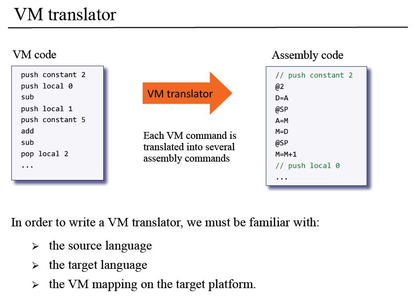
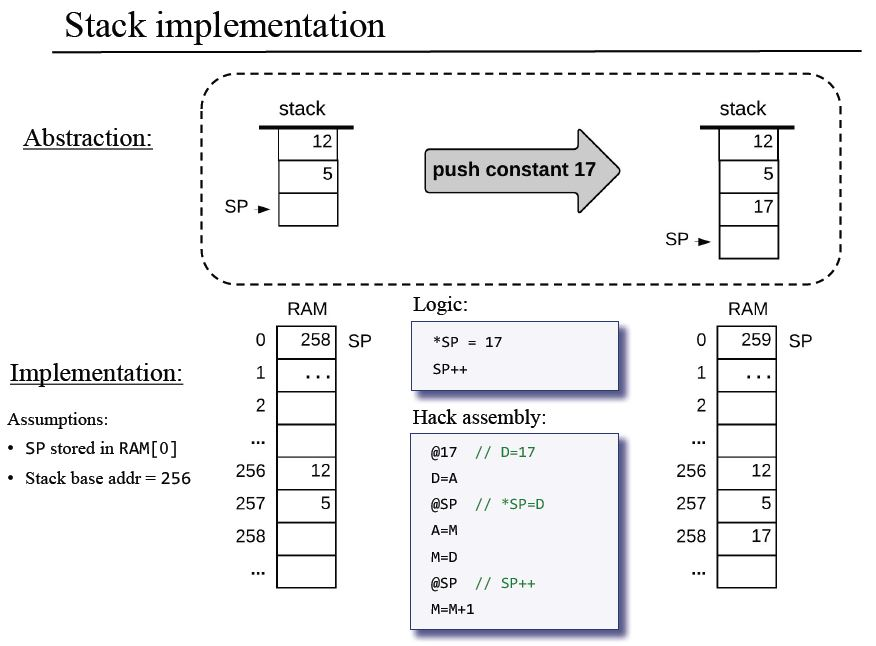

# Hack Virtual Machine Translator  

The Hack Virtual Machine Translator is the back end of a compiler for a typical object-based programming language. 

Written in Python 3 and modeled after the Java Virtual Machine (JVM), this translates stack-based virtual memory segments and related commands into machine language. 

The compiler's front end - [the Jack Compiler](https://github.com/ptdriscoll/jack-compiler) - transforms high-level Jack programs into virtual-machine code. Two-tier compilers using virtual machines provide flexibility that makes it easier to run program codes on multiple platforms.

The translator's generated assembly code is designed to run on a simple general-purpose computer, which is built from scratch in a two-part course called From Nand to Tetris. An accompanying book is called The Elements of Computing Systems: Building a Modern Computer from First Principles. See reference links below. 

 

### Usage

The Virtual Machine Translator reads .vm files and generates .asm files. A path to either a .vm file or a directory with .vm files is fed as a parameter to the command line. For a file, one .asm translation is created at the same location. For a directory, one .asm translation is created within the directory for all .vm files in that directory.

The translator runs vm_translator as a package from the root directory. To pass a course auto-grader, the translator also runs from within the vm_translator directory, using a file called VMTranslator. Tests run only from the root directory. 

Examples from root directory:
- To translate the data/SimpleFunction.vm file: `python -m vm_translator data/SimpleFunction.vm`
- To translate all files in the data/FibonacciElement directory: `python -m vm_translator data/FibonacciElement`
- To translate all .vm files and directories in the data directory: `python -m vm_translator run_all`
- To run a test module, such as test_1_1: `python -m tests.test_1_1`
- To run a specific test, note addition of unittest: `python -m unittest tests.test_1_1.CodeWriterBasic.test_constant`
- To run all tests: `python -m unittest`

Examples from vm_translator directory:
- To translate the data/SimpleFunction.vm file: `python VMTranslator.py ../data/SimpleFunction.vm`
- To translate all files in the data/FibonacciElement directory: `python VMTranslator.py ../data/FibonacciElement`
- To translate all .vm files and directories in the data directory: `python VMTranslator.py run_all`  

 

### References

- Website: https://www.nand2tetris.org/software
- Book: https://www.amazon.com/Elements-Computing-Systems-Building-Principles/dp/0262640686/ref=ed_oe_p
- Book Chapter 7: http://www.cs.huji.ac.il/course/2002/nand2tet/docs/ch_7_vm_I.pdf
- Book Chapter 8: http://www.cs.huji.ac.il/course/2002/nand2tet/docs/ch_8_vm_II.pdf 
- Slides Chapter 7: https://drive.google.com/file/d/19fe1PeGnggDHymu4LlVY08KmDdhMVRpm/view
- Slides Chapter 8: https://drive.google.com/file/d/1lBsaO5XKLkUgrGY6g6vLMsiZo6rWxlYJ/view  
- Course I: https://www.coursera.org/learn/build-a-computer
- Course II: https://www.coursera.org/learn/nand2tetris2
- Jack Compiler: https://github.com/ptdriscoll/jack-compiler